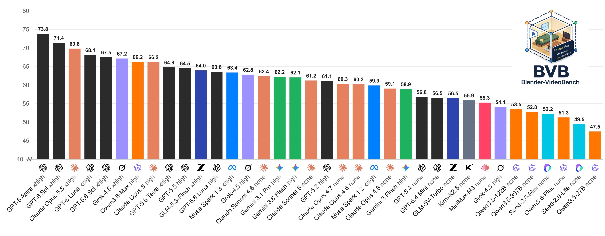
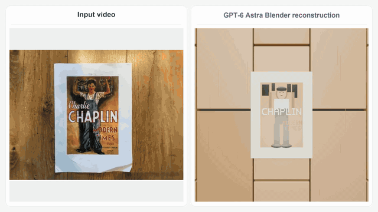
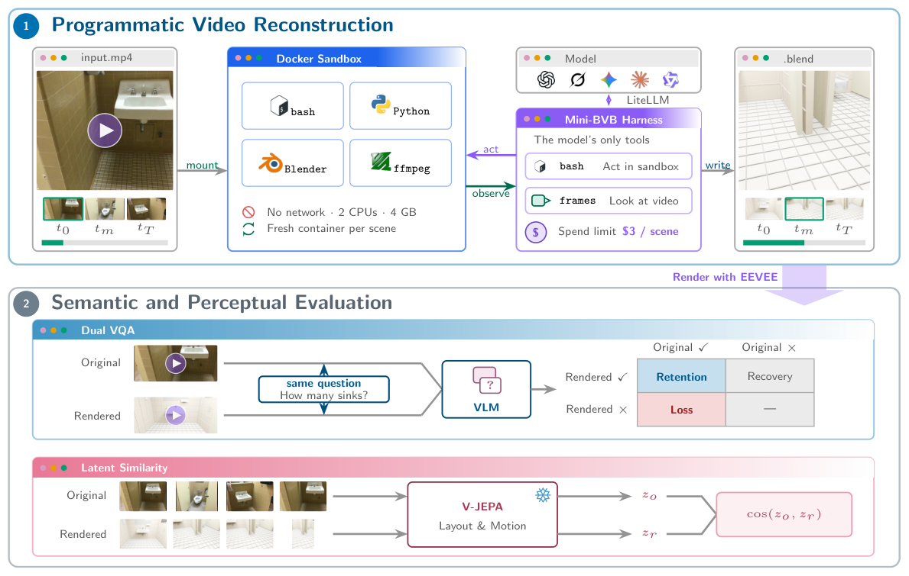

<h1 align="center">BVB: Benchmarking Agentic Video Understanding via Programmatic Reconstruction in Blender</h1>

<p align="center">
  <a href="https://yoloytang.me/BVB/"></a>
  <a href="https://arxiv.org/abs/2609.15478"></a>
  <a href="https://discord.gg/EFs5vBYQWu"></a>
  <a href="LICENSE"></a>
</p>

> **If an agent truly understands a video, it can reconstruct it programmatically.**

<p align="center">
  <a href="https://yoloytang.me/BVB/#leaderboard">
    
  </a>
</p>

We introduce **BVB**, Blender-VideoBench, a benchmark that tests this ability
by asking agents to reconstruct real-world videos as animated Blender scenes.
For a fair comparison, every agent writes its reconstruction through the same
lightweight harness, **Mini-BVB**, in the same sandbox and under the same cost
limit. External asset libraries are not allowed.

<p align="center">
  
</p>
<p align="center">
  <em>Source kitchen video and its GPT-6 Astra reconstruction.</em>
</p>

## News

- **[9/30/2026]** Added GPT-6.1 Sol (xhigh) and Claude Sonnet 5.5 (xhigh) to the
  [leaderboard](https://yoloytang.me/BVB/#leaderboard).
- **[9/28/2026]** Added Claude Opus 5.5 (high and xhigh), GPT-6 Astra (xhigh),
  GPT-6 Sol (xhigh), and GPT-6 Luna (xhigh) to the
  [leaderboard](https://yoloytang.me/BVB/#leaderboard).
- **[9/14/2026]** We released the BVB [paper](https://arxiv.org/abs/2609.15478)
  and [leaderboard](https://yoloytang.me/BVB/#leaderboard).

## Overview

<p align="center">
  <a href="https://yoloytang.me/BVB/">
    
  </a>
</p>

- **288 real indoor videos** from the VSI-Bench test split, drawn from
  ARKitScenes, ScanNet, and ScanNet++.
- **5,130 spatiotemporal questions**, with the same questions asked of every
  reconstruction.
- **51 agent configurations from ten model families**, all evaluated with the
  same sandbox and prompt.
- **Two complementary evaluation axes**. One measures paired video-QA
  retention, and the other measures similarity in a frozen video-embedding space.
- **No external asset libraries**. Agents build all geometry from Blender
  primitives and operators instead of retrieving existing meshes.
- **Animated, executable output**. Each submission is a Blender program and
  scene, not a caption or a static image.

The full interactive results are on the
[project page](https://yoloytang.me/BVB/#leaderboard), and a
[CSV snapshot of all 51 configurations](assets/bvb-results.csv) is included in
this repository. This README covers the benchmark and how to reproduce it.

## Why programmatic reconstruction?

Question answering measures what a model can say about a video.
Programmatic reconstruction asks the model to build a persistent 3D scene that
can be reopened, edited, animated, and rendered.

- **Vision is raw.** Pixels do not explicitly specify the scene that produced them.
- **Language is ambiguous.** Many incompatible scenes fit the same description.
- **Code is executable.** A scene program can be run, inspected, revised,
  and rendered from new viewpoints.

## Benchmark protocol

<p align="center">
  
</p>

1. **Reconstruct.** A cost-limited agent works inside a fresh Blender 4.2
   Docker sandbox with only two tools, `bash` and `frames`. It inspects the
   source video and writes an animated `result.blend`.
2. **Evaluate.** Scoring runs separately from the agent loop. The submitted
   scene is rendered to video, and the render is used for paired video QA and
   encoded by a frozen video model.

### Evaluation axes

| Axis | Signal | What it checks |
|---|---|---|
| **Dual VQA (DV)** | Retention of answers that are correct on the source video | Whether the reconstruction keeps the content needed to answer questions about the source video |
| **Latent Similarity (LS)** | Frozen V-JEPA 2.1 similarity | How well layout and motion agree between the source clip and the rendered reconstruction |

Both axes use a 0–100 scale. Overall is their square-root mean, defined as

$$
\mathrm{Overall} = \left(\frac{\sqrt{\mathrm{DV}} + \sqrt{\mathrm{LS}}}{2}\right)^2.
$$

Compared with an arithmetic mean, this penalizes uneven performance across
the two axes more heavily. Failed reconstructions stay in the evaluation pool
and score zero on both axes.

## Run the benchmark

### 1. Prepare the source videos

BVB uses the real indoor clips from
[VSI-Bench](https://vision-x-nyu.github.io/thinking-in-space.github.io/).
This repository does not redistribute the source videos. Download them from
the upstream dataset and arrange them in the following layout.

```text
VSI-Bench/
  arkitscenes/<scene_id>.mp4
  scannet/<scene_id>.mp4
  scannetpp/<scene_id>.mp4
```

The tracked [`eval/test.jsonl`](eval/test.jsonl) defines the 288 scenes and
5,130 questions in BVB. Use this file to reproduce BVB instead of substituting
a different upstream split.

### 2. Build the Stage-1 sandbox

You need Python 3.10+, Docker, and `ffmpeg`/`ffprobe`. Stage-2 rendering also
needs Blender installed on the host, and LS encoding needs a GPU. Start from the
repository root. The first command below moves into `sandbox/`, and the
remaining steps run from there.

```bash
cd sandbox
docker build -t bvb-sandbox:latest .
python3 -m venv .venv
.venv/bin/pip install -r requirements.txt
```

### 3. Reconstruct a smoke-test subset

```bash
export OPENAI_API_KEY="..."  # or the key required by your provider

.venv/bin/python run_agent.py \
  --model gpt-6-astra \
  --reasoning high \
  --output results/run_001 \
  --cost-limit 3.0 \
  --limit 5
```

Remove `--limit` to run all 288 scenes. Add `--resume` to skip scenes that
already have a `.blend` when restarting an interrupted run. See
[`sandbox/README.md`](sandbox/README.md) for full details on the harness and the
supported providers.

### 4. Render and evaluate the reconstructions

```bash
.venv/bin/python ../eval/batch_render_camera.py \
  --run results/run_001 \
  --num-frames 64 \
  --resume
```

This command only produces the camera renders and does not compute any
scores. If Blender is not on your `PATH`, set `BLENDER_BIN` to the Blender
executable. To score the renders, follow [`eval/README.md`](eval/README.md). It
covers Dual VQA scoring with the judge API, LS scoring with the frozen V-JEPA
encoder, and how to combine the two axes into Overall.

## Restore released run artifacts

Large Stage-1 artifacts are hosted outside GitHub in the Hugging Face dataset
repository `yunlong10/BVB-results`. You need access to this repository before
downloading. Run the following commands from the repository root.

```bash
python3 -m pip install huggingface_hub hf_transfer
hf auth login
HF_HUB_ENABLE_HF_TRANSFER=1 python scripts/download_results.py
```

To restore a single run, pass its name with `--run`.

```bash
HF_HUB_ENABLE_HF_TRANSFER=1 python scripts/download_results.py \
  --run mini-harness-gpt-5.6-sol-reasoning-high-run01
```

## Repository guide

- [`sandbox/`](sandbox/README.md) contains the Stage-1 agent harness and the
  Blender Docker sandbox.
- [`eval/`](eval/README.md) contains the Dual VQA and V-JEPA evaluation code.

## Citation

```bibtex
@misc{tang2026bvb,
  title = {BVB: Benchmarking Agentic Video Understanding via Programmatic Reconstruction in Blender},
  author = {Yolo Y. Tang and Daiki Shimada and Jiayue Meng and Jing Bi and Pinxin Liu and Yicheng Wang and Yunzhong Xiao and Zhangyun Tan and Zeliang Zhang and Chao Huang and Susan Liang and Qianxiang Shen and Luchuan Song and Ali Vosoughi and Mingqian Feng and Melika Filvantorkaman and Chenliang Xu},
  year = {2026},
  eprint = {2609.15478},
  archivePrefix = {arXiv},
  primaryClass = {cs.CV},
  url = {https://arxiv.org/abs/2609.15478}
}
```

## License

BVB is released under the [MIT License](LICENSE).
