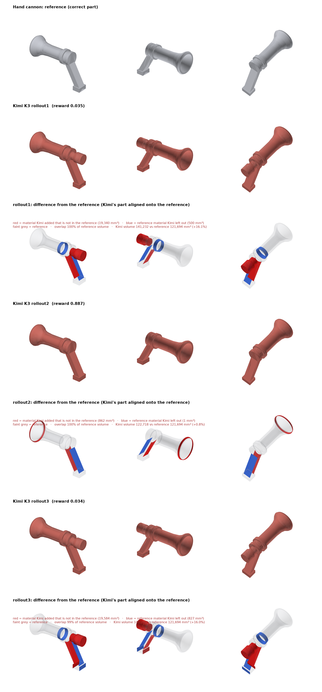

# Kimi K3 on hand-cannon-image: 3 rollouts

All three rollouts used the same task, drawing, verifier and agent settings: mini-swe-agent 2.4.6, reasoning effort `max`, the CAD Bench v3 multimodal config, and `moonshotai/kimi-k3` through the Vercel AI Gateway.

| Rollout | Reward | Geometry | Parameters | Kimi's part vs the reference | Steps |
|---|---|---|---|---|---|
| rollout1 | 0.035 | 0.018 | 25/25 | +19,340 mm³ extra, 500 mm³ missing | 82 |
| rollout2 | 0.887 | 0.797 | 25/25 | +862 mm³ extra, 1 mm³ missing | 77 |
| rollout3 | 0.034 | 0.017 | 24/25 | +19,584 mm³ extra, 827 mm³ missing | 64 |
| **Average** | **0.319** | | | | |

`comparison.png` shows the reference, then each rollout's model, then each rollout's difference from the reference. In the difference rows, red is material Kimi added, blue is reference material Kimi left out, and faint grey is the reference. Kimi's model is aligned onto the reference first, by the axis-aligned rotation and shift with the largest overlap, because the grader ignores placement. The thin red and blue slabs along the grip are slivers under 1 mm thick, caused by a tiny difference in grip angle; the renderer draws their full faces, so they look larger than they are.

## What happened in each rollout

- **rollout1 and rollout3** made the same mistake. In the plan view, Kimi read the outline of the grip and butt behind the rear cap as round sections on the barrel axis. Its notes say `tail Ø22 (x=125-140), tail Ø28 (x=140-162)` (rollout1) and `tang Ø22 (125–140) → Ø28 (140–162)` (rollout3). That adds about 19,500 mm³ of solid that isn't in the part. Both also built the Ø34 breech section as Ø32 (the blue ring), and rollout3 got one printed dimension wrong.
- **rollout2** built the part correctly. The only difference is a slightly oversized muzzle lip (+0.8% volume). Volume gets full credit only within 0.1%, which is why it scored 0.887 rather than about 1.0.

## Folders

| Folder | Harbor job | Trial |
|---|---|---|
| `rollout1/` | `hand-cannon-v2` run (earlier working name; same task) | `hand-cannon-v2-image__QnMqYga` |
| `rollout2/` | `kimi-k3-rollout2` | `hand-cannon-image__ppZ4SFY` |
| `rollout3/` | `kimi-k3-rollout3-hand-cannon` | `hand-cannon-image__qvzmRa7` |

Each rollout folder has the job files (`config.json`, `result.json`, `job.log`, `lock.json`) and the trial folder:
- the agent logs and trajectories (`agent/`)
- Kimi's `answer.py` and `answer.FCStd` (`artifacts/app/`)
- the grader output (`verifier/reward.json`, `reward_details.json`, `answer.png`)

See `../../README.md` for what each file is.

- **rollout1** is partial: only the job config and the trial's result, answer, verifier and agent log files survived (see `../../README.md`).
- **rollout2**'s job ran all three tasks together, so its job-level `config.json`, `result.json` and `job.log` also mention the lobed rotor and tray tasks. Only the hand cannon trial is included here. The lobed rotor trial in that job was stopped by hand and isn't a valid rollout.
