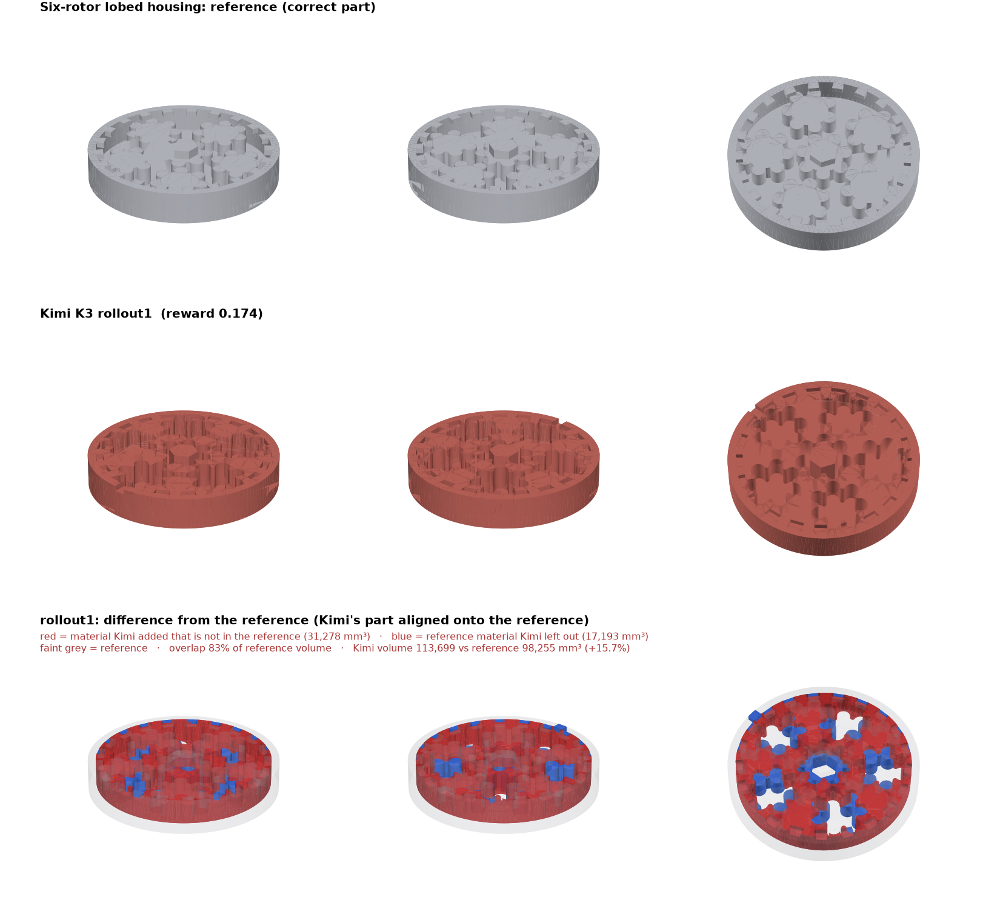

# Kimi K3 on lobed-rotor-image: rollouts

Settings: mini-swe-agent 2.4.6, reasoning effort `max`, the CAD Bench v3 multimodal config, and `moonshotai/kimi-k3` through the Vercel AI Gateway.

| Rollout | Reward | Geometry | Parameters | Kimi's part vs the reference | Steps |
|---|---|---|---|---|---|
| rollout1 | 0.174 | 0.100 | 10/13 | +31,278 mm³ extra, 17,193 mm³ missing | 136 (timed out at 9,000 s) |
| **Average** | **0.174** | | | | |

`comparison.png` shows the reference, Kimi's model, and the difference between them. In the difference row, red is material Kimi added, blue is reference material Kimi left out, and faint grey is the reference. Kimi's model is aligned onto the reference first, by the axis-aligned rotation and shift with the largest overlap, because the grader ignores placement.

## What happened

Kimi built the structure **inverted**:
- **Rotors:** instead of six raised rotors inside an open housing, it made a solid disc and cut the rotor shapes into it as pockets.
- **Crown tabs:** it turned the 21 crown tabs into rectangular holes in the top face.

That adds about 16% volume and gets three diameters wrong:
- housing inner Ø99 (Kimi built 108)
- crown tip Ø91 (Kimi built 108)
- rotor core Ø21.6 (Kimi built 24.4)

The agent hit the 9,000 s limit, and the grader scored the last model it saved.

Section A-A shows hatching across most of the width between the walls, which can be read as solid material and matches Kimi's inverted reading.

A second rollout was started (job `kimi-k3-rollout2`) but stopped by hand partway through for time, so it isn't a valid rollout and isn't included.

## Folders

| Folder | Harbor job | Trial |
|---|---|---|
| `rollout1/` | `kimi-k3-lobed-rotor-official` | `lobed-rotor-image__KB6wjkJ` |

See `../../README.md` for what each file is.
