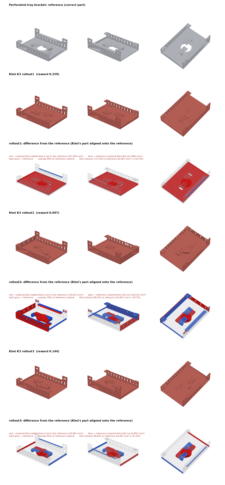

# Kimi K3 on tray-bracket-image: rollouts

All rollouts used the same task, drawing, verifier and agent settings: mini-swe-agent 2.4.6, reasoning effort `max`, the CAD Bench v3 multimodal config, and `moonshotai/kimi-k3` through the Vercel AI Gateway.

| Rollout | Reward | Geometry | Parameters | Kimi's part vs the reference | Steps |
|---|---|---|---|---|---|
| rollout1 | 0.259 | 0.149 | 38/38 | +91,500 mm³ extra, 696 mm³ missing | 170 |
| rollout2 | 0.047 | 0.024 | 38/38 | +34,625 mm³ extra, 18,414 mm³ missing | 144 |
| rollout3 | 0.144 | 0.078 | 38/38 | +24,691 mm³ extra, 6,850 mm³ missing | 124 |
| **Average** | **0.150** | | | | |

`comparison.png` shows the reference, then each rollout's model, then each rollout's difference from the reference. In the difference rows, red is material Kimi added, blue is reference material Kimi left out, and faint grey is the reference. Kimi's model is aligned onto the reference first, by the axis-aligned rotation and shift with the largest overlap, because the grader ignores placement.

## What happened in each rollout

All three rollouts read every printed dimension correctly (38/38) but got the 3D structure wrong.

- **rollout1** made three mistakes:
  - **Invented floor:** it added a solid floor filling the tray from Z 3 to 8, mistaking the side view's 8 mm right rail for a full-width floor.
  - **Octagon not cut:** it built the octagon as raised ribs instead of a through-opening.
  - **Rear shelf:** it stopped the shelf at the rear wall's inner face.
- **rollout2** didn't add the floor, but made a different set of mistakes:
  - **Octagon:** built as a raised boss, the same misread as rollout1.
  - **Right edge:** a full-height 23 mm wall instead of the 8 mm rail.
  - **Front wall:** placed outside the 112 mm depth (Y 112–115), which shifts the walls and shelf.
  - **Platforms:** solid blocks down to the base, with their front-to-back positions swapped.
  - **Left edge:** an extra 4.5 mm lip.
- **rollout3** was the closest attempt: the bounding box is exact, the base, walls and shelf are right, and there's no invented floor. It still made these mistakes:
  - **Octagon:** filled with a raised solid. Its notes say "Centre boss on the tray floor: rib (house-shaped outline, 8 tall)", the same misread as the other two rollouts.
  - **Platforms:** solid 11 mm blocks instead of thin platforms on narrow risers.
  - **Edge strips:** the paired red and blue strips along the edges look like the low rail placed on the opposite side.

## How the drawing shows the octagon opening

The octagon is a through-opening in the 3 mm base. The drawing shows this only by drafting convention:
- **Hidden lines:** the front and side views have dashed hidden lines that run the full thickness of the base, only at the octagon's corners.
- **No raised outline:** a raised boss would appear as an outline above the base in those views, and as a raised block in the isometric view.

The hint is small, though. The base is about 6 px tall at drawing scale, the isometric view shows the opening only as a flat, slightly darker area, and there's no "THRU" note (the drawing has no words). Even without the octagon, every rollout made at least one other mistake that is drawn plainly, so the low scores don't depend on it.

## Folders

| Folder | Harbor job | Trial |
|---|---|---|
| `rollout1/` | `tray-bracket-v3` run (earlier working name; same task) | `tray-bracket-image-v3__3t3What` |
| `rollout2/` | `kimi-k3-rollout2` | `tray-bracket-image__KBAsL7J` |
| `rollout3/` | `kimi-k3-rollout3-tray` | `tray-bracket-image__phtLVMF` |

Each rollout folder has the job files and the trial folder:
- the agent logs and trajectories (`agent/`)
- Kimi's `answer.py` and `answer.FCStd` (`artifacts/app/`)
- the grader output (`verifier/`)

See `../../README.md` for what each file is.

- **rollout1** is partial: only the job config and the trial's result, answer, verifier and agent log files survived (see `../../README.md`).
- **rollout2**'s job ran all three tasks together, so its job-level `config.json`, `result.json` and `job.log` also mention the other two tasks. Only the tray trial is included here.
