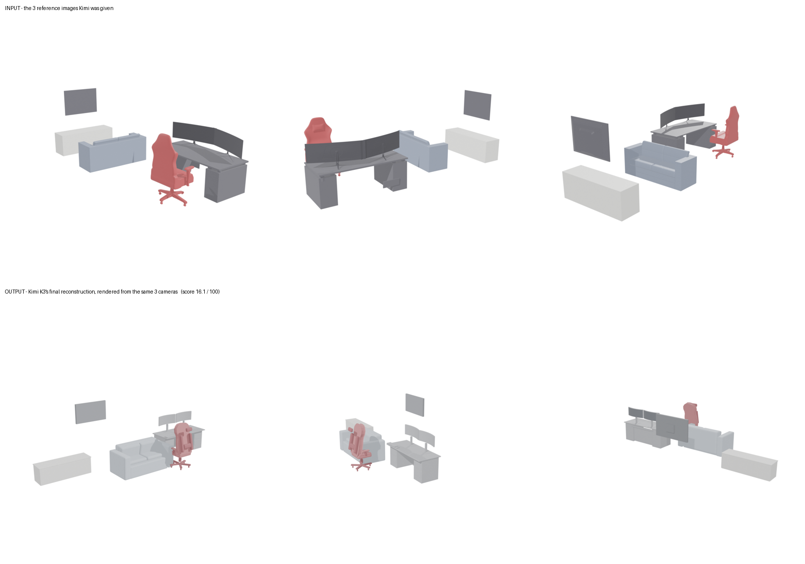
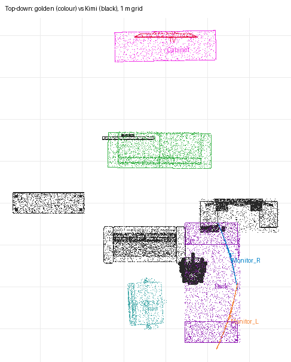

# Sample 2 - Gaming Room Blender File

**Run with the original SceneActBench runner (before the Harbor version).**

**Headline score: 16.1 / 100** (average F-score across the 7 furniture items) · Golden solution: 100.0

**Bottom line:** Kimi recognised all 7 items and gave them the right shapes, but squashed the room to about half its real depth. The cabinet and TV moved off the back wall into the middle, and the desk area moved up beside the sofa. Only the sofa ended up near its real spot.

## How each item is scored
- **Align:** Kimi's whole build is aligned to the real room once (scale, rotation, position).
- **Assign:** each point on Kimi's surfaces is assigned to whichever real item it's closest to.
- **Tolerance:** 5% of that item's own size (e.g., about 17 cm for the desk, about 9 cm for the TV).
- **Two numbers per item:**
  - **Precision:** share of Kimi's points assigned to the item that lie within tolerance of its real surface.
  - **Recall:** share of the real item's surface that Kimi covered within tolerance.
- **Item score:** the F-score, combining precision and recall. The headline is the average of the 7 item scores.

## Per-item results

| Item | F-score | Precision | Recall | What it means |
|---|---|---|---|---|
| Sofa | 0.55 | 0.65 | 0.48 | Closest to its real spot of any item; right shape, partly overlapping the real sofa |
| Desk | 0.36 | 0.34 | 0.39 | Right two-pedestal shape, but moved up beside the sofa instead of the front of the room |
| Chair | 0.21 | 0.27 | 0.17 | Right shape, but sits in the middle of the room instead of beside the desk at the front |
| Monitor (left) | 0.00 | — | 0.00 | None of Kimi's points ended up nearest the real monitor; Kimi's monitors moved with the desk |
| Monitor (right) | 0.00 | — | 0.00 | Same |
| Cabinet | 0.00 | — | 0.00 | About 4 m forward and to the left of the back wall where it belongs |
| TV | 0.00 | — | 0.00 | Placed in the middle of the room instead of on the back wall |
| **Average (headline)** | **0.161** | | **0.149** | |

## Whole-room numbers (secondary)

| Metric | Kimi K3 | Golden solution |
|---|---|---|
| Whole-room F at 5% tolerance (about 43 cm here) | 0.66 | 1.00 |
| ↳ Share of Kimi's build on real furniture | 0.85 | 1.00 |
| ↳ Share of real furniture Kimi covered | 0.54 | 1.00 |
| Whole-room F at 10% tolerance | 0.82 | 1.00 |
| Average position error of matched items | 1.42 m | ~0 |

## Caveat about the zeros
- The per-item scores depend on the single alignment of the whole build.
- In a check without alignment, only the desk scored anything (0.16), giving 2.2 overall. So 16.1 is the more favourable of the two for Kimi.
- The zeros for both monitors, the cabinet and the TV mean Kimi's versions sat closer to other real items (mainly the sofa and desk) than to their own. They don't mean Kimi left them out; it built all of them.

## Where things ended up (top-down, golden in colour, Kimi in black, 1 m grid)

## Run details
- Model: Kimi K3 (`moonshotai/kimi-k3` via Vercel AI Gateway), official SceneActBench Reconstruction prompt, 35-step limit (used all 35), ~11 min.
- No crashes, no errors, no attempts to read the answer key.
- Golden solution: 7 furniture items extracted from `source/gaming_room.blend`, converted from feet to metres (×0.3048) and centred. Figures, speaker, keyboard, ceiling lights, small wall items, room shell and two stray far-away objects removed; flat colours because the download had no textures.
