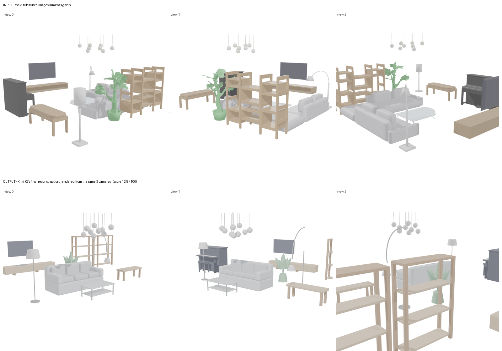
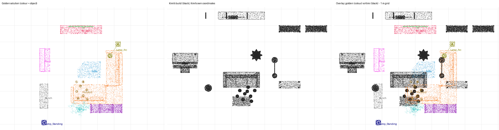

# Sample 1 - Living Room Blender File

**Run with the original SceneActBench runner (before the Harbor version).**

**Headline score: 12.8 / 100** (average F-score across the 11 furniture items) · Golden solution: 100.0

**Bottom line:** Kimi placed most of its geometry near *some* real furniture, so the whole-room score looks decent. Item by item, though, little of it is in the right place with the right shape.

## How each item is scored
- **Align:** Kimi's whole build is aligned to the real room once (scale, rotation, position).
- **Assign:** each point on Kimi's surfaces is assigned to whichever real item it's closest to.
- **Tolerance:** 5% of that item's own size (e.g., about 23 cm for the sofa, about 9 cm for the TV).
- **Two numbers per item:**
  - **Precision:** share of Kimi's points assigned to the item that lie within tolerance of its real surface.
  - **Recall:** share of the real item's surface that Kimi covered within tolerance.
- **Item score:** the F-score, combining precision and recall. The headline is the average of the 11 item scores.

## Per-item results

| Item | F-score | Precision | Recall | What it means |
|---|---|---|---|---|
| Sofa | 0.47 | 0.64 | 0.36 | Partly overlaps the real L-sofa, but Kimi built a straight sofa, so most of the L is missing |
| Bench | 0.36 | 0.29 | 0.46 | Near the real bench footprint, but much of it is off |
| Plant | 0.19 | 0.47 | 0.12 | Close in places, but covers only 12% of the real plant |
| Shelf | 0.18 | 0.48 | 0.11 | Kimi's two shelves are mostly in the wrong spot |
| Arc lamp | 0.15 | 0.10 | 0.36 | Right general area, wrong shape and position |
| Coffee table | 0.06 | 0.05 | 0.07 | About 1.5 m off |
| Piano | 0.01 | 0.04 | 0.01 | About 2 m off and turned 90° |
| TV stand | 0.00 | 0.00 | 0.00 | Kimi's nearby points weren't within tolerance |
| TV | 0.00 | — | 0.00 | None of Kimi's points ended up nearest the real TV |
| Pendant | 0.00 | — | 0.00 | Same |
| Standing lamp | 0.00 | — | 0.00 | Same |
| **Average (headline)** | **0.128** | | **0.136** | |

## Whole-room numbers (secondary)

| Metric | Kimi K3 | Golden solution |
|---|---|---|
| Whole-room F at 5% tolerance (about 42 cm here) | 0.56 | 1.00 |
| ↳ Share of Kimi's build on real furniture | 0.80 | 1.00 |
| ↳ Share of real furniture Kimi covered | 0.43 | 1.00 |
| Whole-room F at 10% tolerance | 0.79 | 1.00 |
| Average position error of matched items | 1.11 m | ~0 |

## Caveat about the zeros
- The per-item scores depend on the single alignment of the whole build.
- In a check without alignment, the pendant scored 0.20 instead of 0, but other items dropped more, giving 7.8 overall. So 12.8 is the more favourable of the two for Kimi.
- The zeros for the TV, pendant, and standing lamp mean Kimi's versions sat closer to other real items than to their own. They don't mean Kimi left them out; it built all of them.

## Where things ended up (top-down, golden in colour, Kimi in black, 1 m grid)

## Run details
- Model: Kimi K3 (`moonshotai/kimi-k3` via Vercel AI Gateway), official SceneActBench Reconstruction prompt, 35-step limit (used all 35), ~14 min.
- No crashes, no errors, no attempts to read the answer key.
- Golden solution: 11 furniture items extracted from `source/InteriorTest.blend` (room shell, decor and corner bushes removed; flat colours because the download had no textures).
